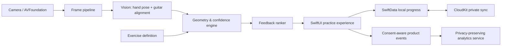

# Apple-first architecture

## Design principles

- On-device first: frames and landmark inference remain in the app process.
- Explainable feedback: translate geometric evidence into a specific, bounded coaching hint.
- Offline-capable: the learner can practise without a network connection.
- Modular intelligence: vision models are versioned assets behind stable domain interfaces.

## System overview

## iOS/iPadOS client

| Layer | Apple technology | Responsibility |
| --- | --- | --- |
| Presentation | SwiftUI, Observation | Practice flow, overlays, accessibility, settings |
| Capture | AVFoundation | Camera lifecycle, orientation, frame throttling |
| Perception | Vision, Core ML, Metal | Hand pose, custom guitar/fret model, fast image transforms |
| Coaching domain | Swift package | Coordinate transforms, target comparison, confidence, feedback rules |
| Persistence | SwiftData + CloudKit | Local-first profiles, exercises, attempts, encrypted private sync |
| Identity/payments | AuthenticationServices, StoreKit 2 | Sign in with Apple, subscriptions, entitlement state |
| Diagnostics | MetricKit, OSLog | Anonymous performance/crash diagnostics and debugging |

Use a feature-oriented modular layout: `Practice`, `Curriculum`, `CoachingEngine`, `CameraCapture`, `Account`, and `SharedUI`; keep geometry/model adapters in `CoachingEngine` so they can be unit-tested against recorded, consented fixture data.

## Vision pipeline

1. Capture a downscaled preview frame; apply device orientation and mirroring transformations exactly once.
2. Run Vision hand-pose detection and lightweight guitar-neck/fret alignment in parallel where hardware permits.
3. Track hand/neck between full detections to limit energy use.
4. Transform fingertip landmarks into normalized neck coordinates; estimate string and fret cells with uncertainty.
5. Compare the estimated configuration with the exercise target and emit evidence objects, never UI strings.
6. Rank evidence using confidence, persistence across frames, and pedagogical severity; the UI renders the selected cue.

## Cloud boundary

CloudKit private database holds account profile, curriculum progress, and opt-in teacher-share summaries. It does not receive camera frames. If a future diagnostic-upload feature is added, put it behind an explicit consent flow, encrypt objects in transit and at rest, set retention controls, and isolate it from ordinary progress sync.

## Model lifecycle

- Begin with Apple Vision hand pose plus deterministic geometry for static chord shapes.
- Gather only consented, de-identified evaluation clips with documented representation coverage.
- Train/evaluate models offline; record model card, device performance, accuracy by setup, and known failure modes.
- Ship signed/versioned Core ML models in the bundle first; allow background model updates only with rollback, Wi-Fi preference, and model-version telemetry.

## Security and compliance guardrails

- Keychain for tokens; Secure Enclave where an app-specific key is needed.
- App Transport Security, least-privilege CloudKit roles, and no embedded long-lived server secrets.
- Privacy nutrition labels, consent ledger, deletion/export workflow, and age-appropriate design review before launch.
- Threat-model camera, cloud sync, account recovery, and teacher-sharing separately.

## Recommended backend posture

Start serverless with CloudKit and App Store Connect; add a small Apple-compatible API only when product needs cannot be met by private sync (for example, subscription entitlement reconciliation or a teacher organization service). Keep it stateless, OAuth/OIDC-based, and free of raw video by default.

